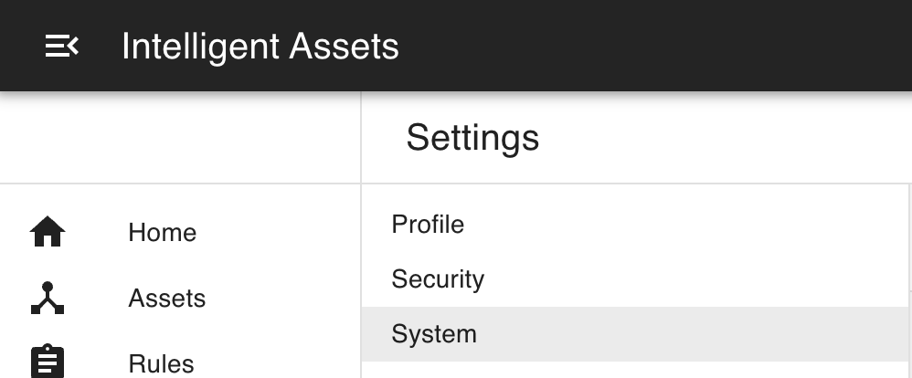
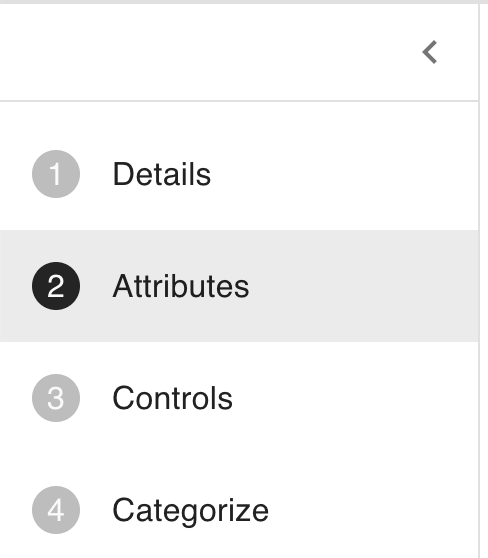

# Usage
In order to use this widget from within the Intelligent Assets application, you will need to perform the following steps:

1. Add the micro-frontend to Intelligent Assets
2. Select the widget as a custom view widget within an asset type
3. Configure the widget in the asset type

The following sections will provide more detail related to the previously mentioned steps.

## Add the micro-frontend to Intelligent Assets

1. Select the User menu in the upper right-hand corner of the screen and select _Settings_


2. Select _System_ under __Settings__


3. Scroll down to the section labled __Plugin settings__ and click the __+__ icon


4. In the resulting form, supply appropriate values to 


  * Label - __Gate Status__
  * Data Type - __True/False__
  * Widget Mode - __View__
  * Plugin URL - __https://cdn.jsdelivr.net/gh/ClearBlade/ia-microfrontends@{PLUGIN_VERSION}/dist/attributeViewWidgets_GateStatus.js__

5. Click the _Done_ icon (the check mark) in the upper right-hand corner of the form

## Select the widget as a custom view widget within an asset type
1. In the _Intelligent Assets_ application, select the asset type you wish to apply the _Gate Status_ widget to.
2. Edit the asset type by clicking the pencil icon in the upper right-hand corner
3. Select _Attributes_ on the left-hand side of the screen

4. Either define a new __True/False__ attribute or scroll to an existing __True/False__ attribute.
5. Under __View widget settings__, specify _Gate Status_ as the widget

6. Click __Next__ in the wizard until you are on the last step. Once on the last step in the wizard, click __Save__

## Configure the widget in the asset type
At the moment, it is not possible to configure the _Gate Status_ widget in the __Intelligent Assets__ application. Configuration must be done manually by editing the json in the _schema_ column of the __asset_types__ collection.

The _Gate Status_ widget requires 5 _attributes_ to be defined on the asset type (in addition to the previously created attribute for _Gate Status_). The 5 attributes must map to the following configuration values:

  1. gateUp
  2. gateDown
  3. gateControl
  4. bellStatus
  5. flip (This attribute indicates whether or not the orientation of the widget should be flipped on the screen)

The following json should be used as a sample for the __custom_view_settings__ attribute:

```json
    "custom_view_settings": {
      "gateUp": {
        "attribute": "gateUp",
        "color": {
          "on": "green",
          "off": "black"
        }
      },
      "gateDown": {
        "attribute": "gateDown",
        "color": {
          "on": "green",
          "off": "black"
        }
      },
      "gateControl": {
        "attribute": "gateControl",
        "color": {
          "on": "green",
          "off": "black"
        }
      },
      "bellStatus": {
        "attribute": "bellStatus",
        "color": {
          "on": "red",
          "off": "black"
        }
      },
      "flip": {
        "attribute": "flip",
        "color": {
          "on": "green",
          "off": "black"
        }
      }
    },
  ```json

  The value of the __attribute__ attribute in each of the key items under __custom_view_settings__ must be the name of a custom_data attribute defined in the _asset_type_.